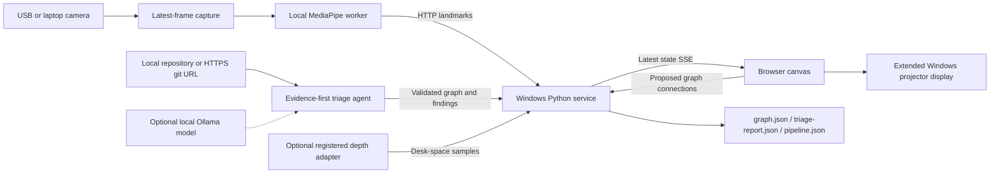

# SynapseDesk — Windows laptop subsystem

A local service for turning repository evidence into a projected engineering graph, with camera-based hand interaction. **The target is a Windows computer. There is no QNX, Raspberry Pi controller, GPIO relay, or physical safety claim in this version.** Existing `rig/` pages remain independent.

## Run the demo on Windows

Install 64-bit Python 3.12 with its `py` launcher. Open PowerShell in this directory:

```powershell
.\scripts\Setup.ps1
.\scripts\Start-SynapseDesk.ps1 -Demo
```

Open [the local workbench](http://127.0.0.1:8770) in Edge or Chrome. No Node.js, camera, model download, or cloud account is needed for the demo. It analyzes the included contradictory repository and displays a **SIMULATED HAND**. Ctrl+C stops the service. If organizational PowerShell policy prevents scripts, use the equivalent commands below; no execution-policy change is necessary:

```powershell
py -3.12 -m venv .venv
.\.venv\Scripts\python.exe -m pip install -e .
.\.venv\Scripts\python.exe -m synapsedesk serve --demo
```

Installation may need internet for packaging dependencies; the installed demo and local repository analysis run offline. This is a foreground service subsystem, not a registered Windows Service Control Manager service. Keep the source checkout in place: editable installation uses its adjacent web assets.

## Modules

| Module | Responsibility |
|---|---|
| `synapsedesk/` | Loopback HTTP service, versioned contracts, latest-state SSE at 30 Hz, bounded requests, graph publication, session token, SQLite persistence (`store.py`), agent task lifecycle (`state.py`) |
| `laptop_hand_tracking/` | Optional Windows camera worker, local MediaPipe palm/landmark inference, pinch gating, simulator, calibrated depth-point filtering |
| `web_ar_canvas/` | Dependency-free HTML5 Canvas, skeletal HUD, homography calibration, pinch/mouse dragging, animated wires, evidence panel, component search, chrome-free `/display` route |
| `repo_triage_agent/` | Polyglot evidence extraction (`analyze.py`, `adapters.py`, `universal.py`, `rust.py`, `tsplugins.py`), source/doc reconciliation, import-cycle detection, optional local LLM review (`reasoner.py`), scoped agent tasks (`provider.py`, `workingcopy.py`) |
| `frontend/` | Pinned React/Monaco/Three.js toolchain, dormant until [the tripwire](frontend/TRIPWIRE.md) trips; vendored builds serve from `/vendored/*` |
| `scripts/`, `config/`, `docs/` | PowerShell launchers, service manifest, API and pitch runbook |



## Use a real camera

Stop the demo, then install the optional camera dependencies and save the model described in [models/README.md](models/README.md):

```powershell
.\scripts\Setup.ps1 -Tracking
.\scripts\Start-SynapseDesk.ps1 -Repo 'C:\projects\my-repo'
```

In a second PowerShell window, from this directory:

```powershell
.\scripts\Start-Tracking.ps1 -Camera 0 -Backend dshow
```

Use `-Camera 1` for another camera or `-Backend msmf` if DirectShow fails. Windows **Settings → Privacy & security → Camera** must allow desktop camera apps. The default is unmirrored; `-Mirror` changes the camera coordinate frame and requires recalibration. The service refuses real camera packets while demo mode is active.

The capture thread continuously drains frames; inference consumes the most recent frame. The worker uses MediaPipe Tasks in VIDEO mode with one hand and 0.65 detection/presence/tracking thresholds. Returned handedness scores are deliberately not reported as tracking confidence. Pinch is Euclidean distance between landmarks 4 and 8 with aspect compensation and on/off hysteresis (0.035/0.055 image-width units).

Three accepted frames are needed before gestures activate. A missing hand, out-of-workspace landmark, or stale acquisition disables gestures. The service expires frames after 250 ms including the worker's reported processing age. The browser independently releases a pinch if state delivery stops for 250 ms. This is a UI control policy, not deterministic timing or personnel protection.

## Calibrate the projector

1. Use Windows **Win+P → Extend**. Move the browser to the projector display, set its final resolution/scaling, then click **Fullscreen** or press **F**.
2. Press **C**. Place the index fingertip on each projected cross and press **Space** on the laptop keyboard to capture its camera coordinate. Four points determine the homography. Degenerate input is rejected.
3. Press **H** for a clean projection. **H** restores controls; **Esc** cancels calibration or an in-progress connection.
4. Pinch over a node to drag it; release to place it. Mouse dragging also works for rehearsal. **W** switches to wiring: pinch/click the source, release, then select a different destination.

Node placements are saved to the service, so they survive a refresh, a restart, and the browser. Open
[`/display`](http://127.0.0.1:8770/display) on the projector for a chrome-free view of the same graph: it
follows the editor's placements and graph revisions and never writes back. Press **H** there to bring the
controls back.

Camera coordinates and projector positions remain normalized; pixels are computed at render time. Homography is a planar mapping: a hand raised above the desk incurs parallax. Z is relative hand depth, not absolute desk height. Calibrate at the working plane. Recalibrate after moving the camera/projector, changing mirror mode, or changing display geometry. Calibration is stored in that browser's local storage; positions are session-local. Wiring saves a **proposed** pipeline, not executable repository edits.

## Repository agent and Rox track

Enter a local folder or an explicit HTTPS git URL and choose **Analyze**. Git must be installed for URLs. The agent scans without importing code, running builds, installing repository dependencies, or executing hooks/submodules. Symlinks and common generated/vendor directories are excluded; file and graph budgets fail explicitly or produce coverage findings.

Evidence extraction runs in three declared tiers, and every node records which parser produced it:

| Tier | Languages | What is extracted |
|---|---|---|
| Full | Python (stdlib `ast`) | Modules, classes, functions, imports, resolvable direct calls, literal route decorators, docstrings |
| Full | Rust, TS/JS, C/C++, Java, Kotlin, Go (tree-sitter) | Symbols, imports/includes, same-file and same-package call resolution, Cargo/npm/go.mod package graphs |
| Heuristic | Ruby, PHP, C#, Swift, shell, and other text sources | Line-pattern definitions and imports only, marked `parser=heuristic` with `verified: false`; calls are never invented |
| Inventory | Anything else | The file appears as a module with an explicit coverage finding |

Tree-sitter grammars are optional. Without them the tier-1 languages fall back to heuristic extraction rather
than failing, and `meta.plugin_files` reports which parser actually ran on how many files. Install them with
`.\scripts\Setup.ps1 -Polyglot` (or `-Rust`, `-Ts`, `-CFamily`, `-Jvm`, `-Go` individually).

Dynamic dispatch, macros, generated code, route prefixes, reflection, and Python import side effects are not
inferred; unresolved references become explicit `external` nodes. Unmatched documentation is a review
candidate, never proof of a dead endpoint.

The agent executes concrete actions: it validates and publishes the architecture graph, produces an evidence report, and updates the browser. Gesture-created connections persist as a separate proposed pipeline. Each successful scan replaces the graph and proposed connections; export `.runtime/pipeline.json` before rescanning if you want to retain a proposal.

To add probabilistic conflict interpretation, install Ollama and a model that fits your laptop, then start with its installed model name:

```powershell
.\scripts\Start-SynapseDesk.ps1 -Repo 'C:\projects\my-repo' -Model 'YOUR_INSTALLED_MODEL'
```

The adapter calls only `http://127.0.0.1:11434/api/chat`. It sends bounded evidence summaries, requests structured JSON, validates finding references, and labels reasoning as unverified suggestions. Model failure still publishes the deterministic graph with an error annotation. Without `-Model`, triage is deterministic and makes no claim to have called an LLM. Repository text is untrusted data and cannot create executable actions or change workspace constraints.

**No Rox-specific API/SDK is integrated:** none was supplied. `reasoner.py` is the replaceable provider boundary. This provides a working agent workflow for the stated track concept, not a claim of organizer compliance or a fabricated Rox integration.

## Scoped agent tasks

The **AGENT** panel does three things against the indexed graph. **Explain selection** answers from the index
alone — the node, its evidence path and line, and its edges — with no model call. **Implement** opens a task:
the service copies the repository working tree into `.runtime/workingcopies/task_<id>/`, asks the configured
provider for a scoped proposal, writes `PROPOSAL.md` into that copy, runs the check commands of whichever
language dominates it, and re-indexes the copy for a graph delta. **Tasks** lists them with their status.

**This is the one path that runs repository commands.** Scanning never imports or executes what it reads, but a
task's check step runs that language's build/test command (`python -m unittest`, `cargo test`, `npm test`,
`go test ./...`, …) inside the working copy — which executes that repository's code and its configured tooling.
Each command is capped at 60 seconds and at most five run. Only start a task on a repository you trust.

Nothing touches your checkout. Every write is confined to the working copy and records a checkpoint holding a
unified diff and the prior content, so `POST /api/agent/tasks/{id}/rollback` restores it. Cancellation is
cooperative: it is checked between stages and cannot interrupt a check already running. A failed task stays
listed with its error and a recoverable checkpoint rather than disappearing.

The provider is a **stub by default and refuses every call** — the live-agent gate is blocked and says so.
Supplying a Chat Completions-compatible endpoint opens it:

```powershell
$env:SYNAPSEDESK_API_KEY = 'your-key'
.\scripts\Start-SynapseDesk.ps1 -Repo 'C:\projects\my-repo' `
  -ModelEndpoint 'https://your-endpoint/v1' -ModelName 'your-model'
```

The key is read from the environment only; it never reaches the index, an artifact, or a response. `provider.py`
is the replaceable boundary — `GET /api/provider/status` reports which one is live, `GET /api/provider/test`
probes it. This path sends bounded task text to whatever endpoint you configure; the deterministic analysis
above, and the local Ollama reviewer below, do not.


## Optional Kinect/depth input

`POST /api/spatial` accepts at most 1,000 **already calibrated** `[normalized desk X, normalized desk Y, height metres]` points. The filter removes invalid/out-of-range input, plane noise, and isolated cells; recent obstacle cells appear in amber. This is visualization only.

A Windows Kinect capture/registration adapter is **not included**. Its implementation depends on Kinect v1 versus v2, the installed SDK/driver, USB hardware, and desk calibration. Do not send raw camera-space depth to this endpoint. See [the protocol](docs/PROTOCOL.md) for the adapter contract. No Raspberry Pi Camera Module 3 interface is assumed on Windows; use a camera exposed by an installed Windows capture backend.

## Artifacts and testing

State lives in `.runtime/` (gitignored). `synapsedesk.db` is the authoritative SQLite store: graph revisions,
an append-only event log, node positions, agent tasks, and each task's provider conversation. A restart restores
the latest graph, its job status, and saved node placements; an older `graph.json` is imported once and left in
place. `.runtime/workingcopies/` holds per-task working copies.

The JSON files beside it are exports, not configuration: `graph.json`, `triage-report.json`, `pipeline.json`
after wiring, and `interaction-bounds.json` after a bounds update. Scanned repositories are never modified —
agent tasks write only inside their own working copy.

```powershell
.\scripts\Test.ps1
# Analyze without the browser:
.\.venv\Scripts\python.exe -m synapsedesk analyze 'C:\projects\my-repo' --out .runtime\export.json
```

Python tests cover gesture loss/reacquisition, invalid frames, stream ownership, AST and tree-sitter symbol
extraction, scan budgets and partial graphs, graph validation, model reference validation, spatial noise
filtering, HTTP boundaries and authorization, SQLite persistence and restart restore, position validation, the
blocked provider gate, working-copy sandboxing and rollback, and the agent task lifecycle. Polyglot tests skip
with an explicit message when the optional grammars are not installed. Optional Node tests cover homography
mathematics; Node is not a runtime dependency. Hardware camera capture, projector alignment, Windows PowerShell
launchers, and local-model performance require validation on your Windows machine.

See [the three-minute runbook](docs/PITCH.md) and [service contracts](docs/PROTOCOL.md).
